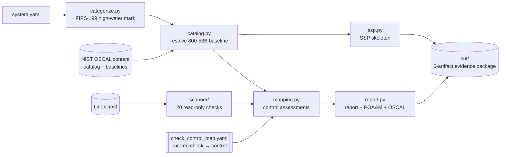

# Castellan

**A command-line NIST 800-53 / RMF compliance toolkit**: describe an
information system in plain YAML, and Castellan derives its FIPS-199
categorization and SP 800-53B control baseline, generates a System Security
Plan, scans a Linux host with read-only hardening checks, and produces a
control-by-control compliance report — in both human-readable Markdown and
machine-readable [OSCAL](https://pages.nist.gov/OSCAL/).

*(A castellan was the officer responsible for a fortress's defenses.)*

## Why this exists

The NIST **Risk Management Framework** is how U.S. federal systems (and many
others) get authorized to operate: **Categorize** the system's impact level
(FIPS-199), **Select** a control baseline (SP 800-53B), **Implement** the
controls, and **Assess** whether they're actually in place. In practice the
governance side (control catalogs, SSPs, POA&Ms) and the engineering side
(actual host configuration) live in different worlds, connected by hand.

Castellan walks the whole lifecycle end to end and makes that connection
explicit: every technical check it runs is mapped — in an auditable,
hand-curated table modeled on DISA's CCI — to the 800-53 controls it
evidences. The output is an artifact set a real assessor would recognize.

## Architecture



One invocation — `castellan report system.yaml -o out/` — produces:

| Artifact | What it is |
| --- | --- |
| `ssp.md` | System Security Plan skeleton: categorization rationale + every baseline control with statement and implementation status |
| `ssp.json` | OSCAL `system-security-plan` (shape mirrored from NIST's published example) |
| `compliance_report.md` | Executive summary, per-family rollup, per-control detail with check evidence |
| `poam.md` | Plan of Action & Milestones: one item per failed/partial control, with remediation |
| `poam.json` | OSCAL `plan-of-action-and-milestones` |
| `assessment_results.json` | OSCAL `assessment-results`: an observation per check, a finding per assessed control |

## Quickstart

```sh
pip install -e .
castellan fetch                                  # one-time: cache NIST OSCAL content
castellan categorize examples/sample_system.yaml # FIPS-199 + baseline selection
castellan checks list                            # the 20 checks + mapped controls
castellan scan                                   # read-only host scan (Linux)
castellan report examples/sample_system.yaml -o out/   # the whole package
```

Every command is documented via `--help`, exits non-zero on error, and after
the one-time `fetch` the entire flow runs offline.

## Sample run (real output, committed)

[`examples/output/`](examples/output/) contains the artifact set generated by
running `castellan report` against the worked example system on a **real
Ubuntu host** — not mocked, not hand-edited. The numbers tell an honest
story:

```
Eastport Benefits Portal — moderate baseline (287 controls)

scan:    8 pass · 5 fail · 1 error · 6 not applicable   (20 checks)
controls: 5 implemented · 4 partial · 2 not implemented · 276 not assessed
11 of 287 controls technically assessable; 45.5% of those fully passing
6 POA&M items open
```

What the host got right: clean `/etc/shadow`/`/etc/passwd` permissions, no
world-writable system files, only root at UID 0, rsyslog + journald running
with restrictive log modes, unattended security updates enabled.

What landed on the POA&M ([`poam.md`](examples/output/poam.md)): **auditd not
running** (AU-2, AU-12), **no host firewall** (SC-7), passwords that never
expire and no minimum length policy (IA-5), and a world-readable `/etc/crontab`
(AC-3, AC-6) — each item carrying the exact failing check and its remediation
command.

The honest edges are deliberate and visible: the six SSH checks report
*not applicable* (no OpenSSH server on that host) rather than fake passes, and
the `/etc/shadow` empty-password check reports an *error* ("not readable; run
the scan as root") rather than pretending it looked.

## Design decisions

- **Never auto-pass.** 276 of 287 controls show `not_assessed` because most
  800-53 controls are organizational — a host scan cannot prove an incident
  response plan exists. A tool that claimed otherwise would be lying;
  credibility is the entire point of a compliance report.
- **The mapping is the product.** `data/mappings/check_control_map.yaml`
  records *why* each check evidences each control (root-login → AC-6/IA-2,
  log permissions → AU-9, shadow permissions → AC-3/SC-28…). Tests verify
  every check is mapped, every mapped control exists in the rev5 catalog and
  the moderate baseline, and no stale entries survive a check rename.
- **Read-only by construction.** Checks reach the host only through a
  five-method `Host` interface (read a file, stat, walk, query a service) —
  there is no write path. Tests substitute an in-memory fake host built from
  fixture files, so the suite is deterministic, OS-independent, and never
  inspects the machine running it.
- **One bad check never kills a scan.** The runner records per-check
  exceptions as `outcome: error` and keeps going.
- **Real NIST data, structurally faithful OSCAL.** The catalog and baselines
  are NIST's published OSCAL JSON (fetched once, cached). Output documents
  mirror the shapes of NIST's published examples, with deterministic UUIDv5
  identifiers so regenerating a document yields stable ids.

## Repository layout

```
src/castellan/
├── categorize.py        # FIPS-199 high-water mark -> baseline selection
├── catalog.py           # OSCAL catalog parsing + baseline resolution
├── ssp.py               # SSP markdown + OSCAL ssp.json
├── scanner/             # Host protocol, check base class, 20 checks, runner
├── mapping.py           # check results -> control assessments
├── report.py            # compliance report, POA&M, OSCAL assessment-results
└── cli.py               # Typer CLI wiring it together
data/mappings/           # the curated check -> control map (committed)
examples/                # worked example system + real generated output
tests/                   # 208 tests, all fixture-based (97% coverage)
```

## Engineering hygiene

- `ruff` and `mypy --strict` pass clean; CI runs lint, type-check, and tests
  with a coverage gate (≥80%; currently 97%) on every push.
- No network in tests, no host mutation anywhere in the codebase, no secrets.
- Python 3.11+, Pydantic v2 models as the contract between modules, Typer CLI,
  Jinja2 templates.

## Scope

Castellan audits a host you own for compliance posture. It is not a
vulnerability scanner, does not exploit anything, and implements a curated,
correct subset of CIS/STIG-style checks rather than pretending to breadth.
See [SPEC.md](SPEC.md) for the full design.

## License

MIT — see [LICENSE](LICENSE).
